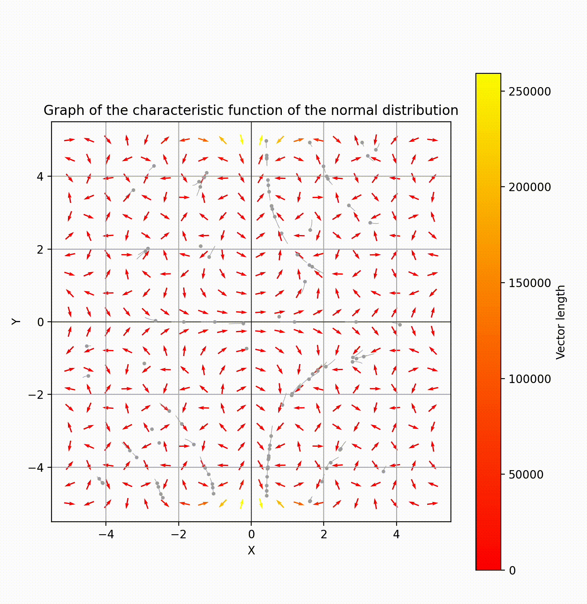
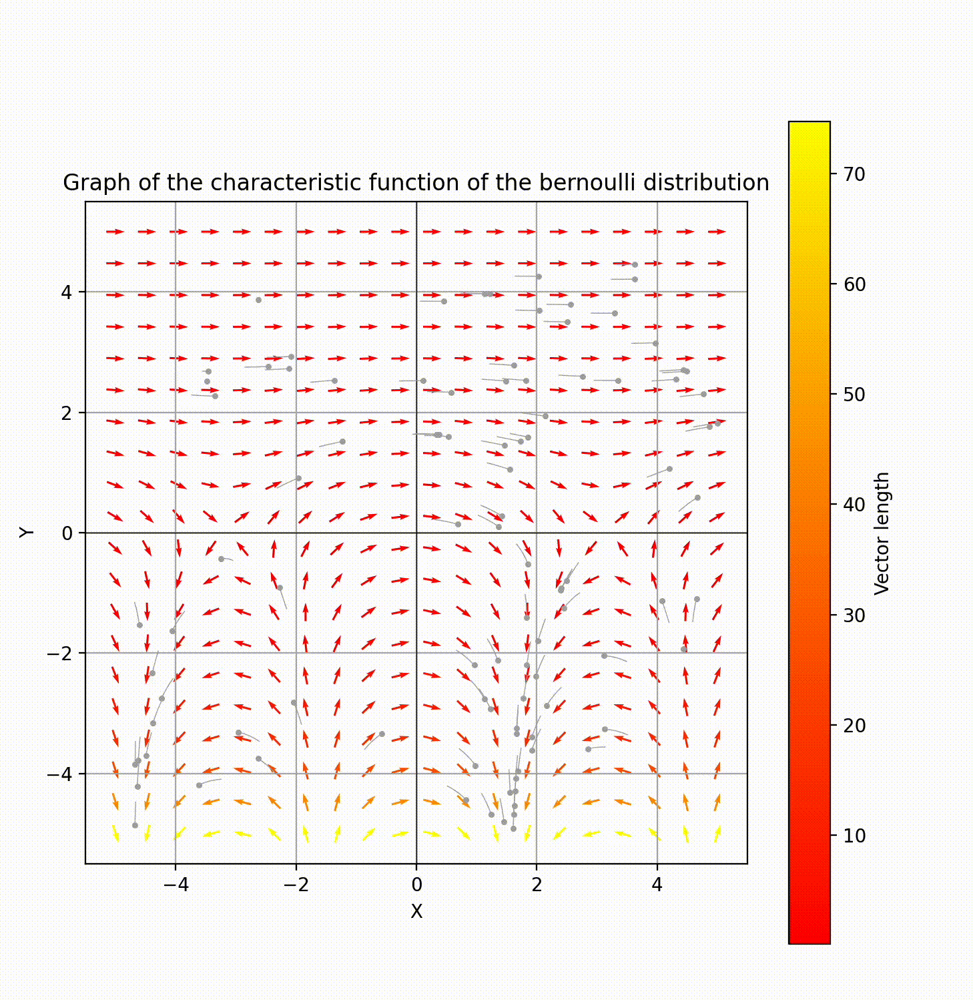
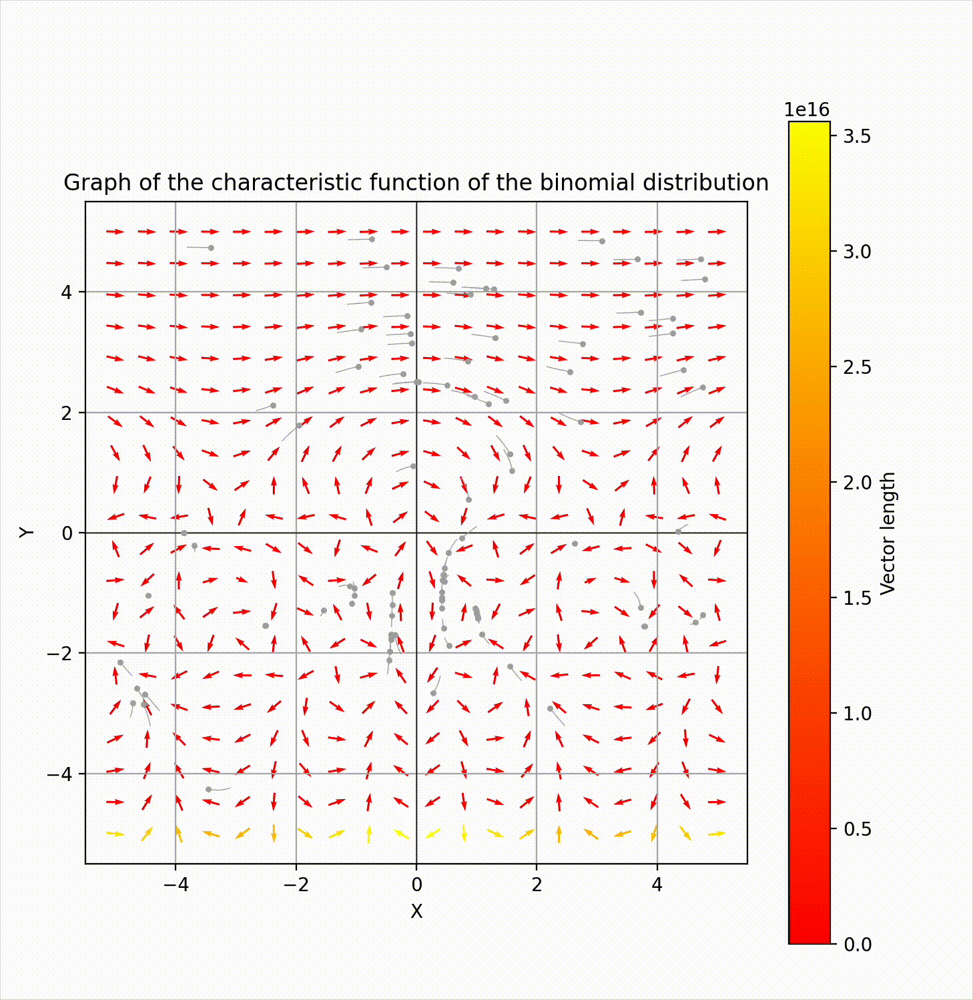
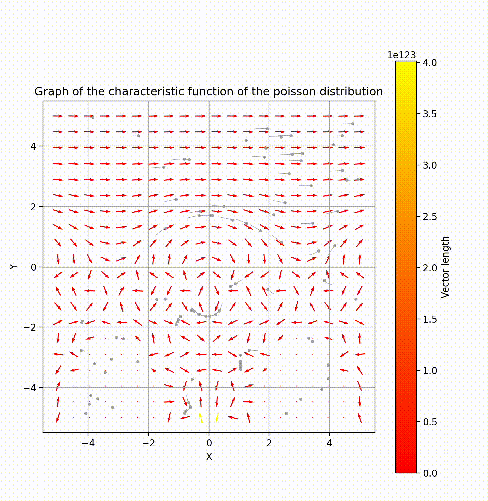
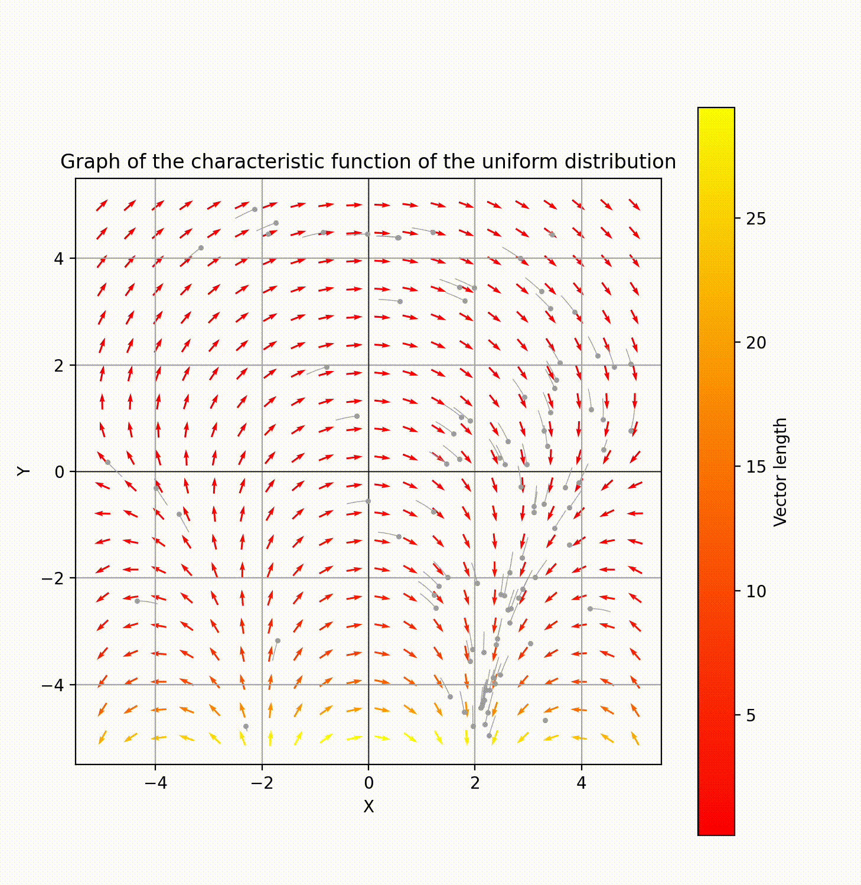
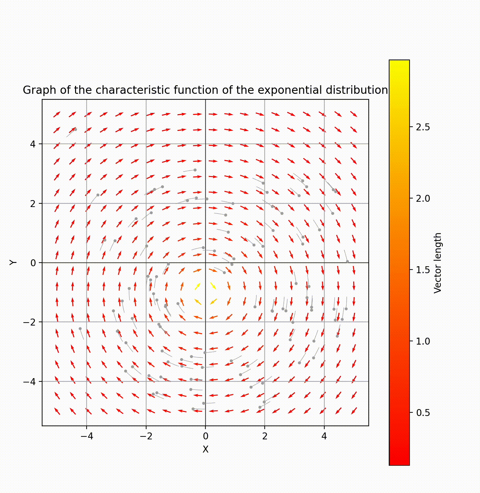

# Characteristic Functions of Distributions

The characteristic function of a random variable is defined as:$\phi_X(t) = \mathbb{E}\left[e^{itX}\right]$,
where $\mathbb{E}$ is the expectation, $i$ is the imaginary unit, and $t \in \mathbb{R}$.

---

## Examples of Distributions and Their Plots
First, let's import the necessary modules:
```python
from polya_fields_visualization import visualization, visualization_sphere, animate_sphere, visualization_anim
import numpy as np
```

### 1. Normal Distribution $\mathcal{N}(\mu, \sigma^2)$
- **Parameters**: $\mu \in \mathbb{R}$, $\sigma^2 > 0$.
- **Characteristic function**:$\phi(t) = \exp\left(i\mu t - \frac{\sigma^2 t^2}{2}\right).$
```python
def normal_characteristic(t, mu=1, sigma=5):
    return np.exp(1j * mu * t - 0.5 * (sigma ** 2) * (t ** 2))

visualization_anim(normal_characteristic, (-5, 5, 20), (-5, 5, 20), show_vectors=True, num_particles=100, title_plot="Graph of the characteristic function of the normal distribution")
```


### 2. Bernoulli Distribution $\text{Bernoulli}(p)$
- **Parameter**: $p \in [0, 1]$.
- **Characteristic function**:$\phi(t) = 1 - p + pe^{it}.$
```python
def bernoulli_characteristic(t, p=0.5):
    return 1 - p + p * np.exp(1j * t)

visualization_anim(bernoulli_characteristic, (-5, 5, 20), (-5, 5, 20), show_vectors=True, num_particles=100, title_plot="Graph of the characteristic function of the bernoulli distribution")
```

### 3. Binomial Distribution $\text{Binomial}(n, p)$
- **Parameters**: $n \in \mathbb{N}$, $p \in [0, 1]$.
- **Characteristic function**:$\phi(t) = (1 - p + pe^{it})^n.$
```python
def binomial_characteristic(t, n=10, p=0.3):
    return (1 - p + p * np.exp(1j * t))**n

visualization_anim(binomial_characteristic, (-5, 5, 20), (-5, 5, 20), show_vectors=True, num_particles=100, title_plot="Graph of the characteristic function of the binomial distribution")
```


### 4. Poisson Distribution $\text{Poisson}(\lambda)$
- **Parameter**: $\lambda > 0$.
- **Characteristic function**:$\phi(t) = \exp\left(\lambda(e^{it} - 1)\right).$
```python
def poisson_characteristic(t, l=2):
    return np.exp(l * (np.exp(1j * t) - 1))

visualization_anim(poisson_characteristic, (-5, 5, 20), (-5, 5, 20), show_vectors=True, num_particles=100, title_plot="Graph of the characteristic function of the Poisson distribution")
```

### 5. Uniform Distribution $\text{Uniform}(a, b)$
- **Parameters**: $a < b$.
- **Characteristic function**:$\phi(t) = \frac{e^{itb} - e^{ita}}{it(b - a)}.$
```python
def uniform_characteristic(t, a=0, b=1):
    if t == 0:
        return 1.0
    return (np.exp(1j * t * b) - np.exp(1j * t * a)) / (1j * t * (b - a))

visualization_anim(uniform_characteristic, (-5, 5, 20), (-5, 5, 20), show_vectors=True, num_particles=100, title_plot="Graph of the characteristic function of the uniform distribution")
```

### 6. Exponential Distribution $\text{Exp}(\lambda)$
- **Parameter**: $\lambda > 0$.
- **Characteristic function**:$\phi(t) = \frac{\lambda}{\lambda - it}.$
```python
def exponential_characteristic(t, l=1):
    return l / (l - 1j * t)

visualization_anim(exponential_characteristic, (-5, 5, 20), (-5, 5, 20), show_vectors=True, num_particles=100, title_plot="Graph of the characteristic function of the exponential distribution")
```

